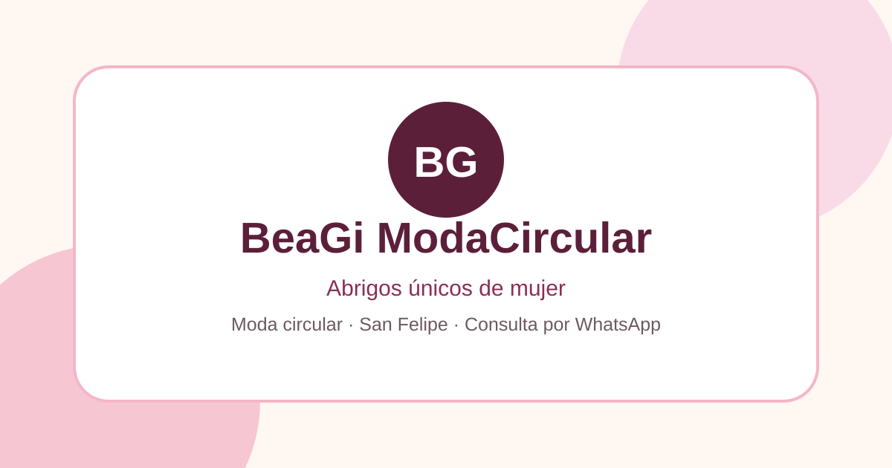
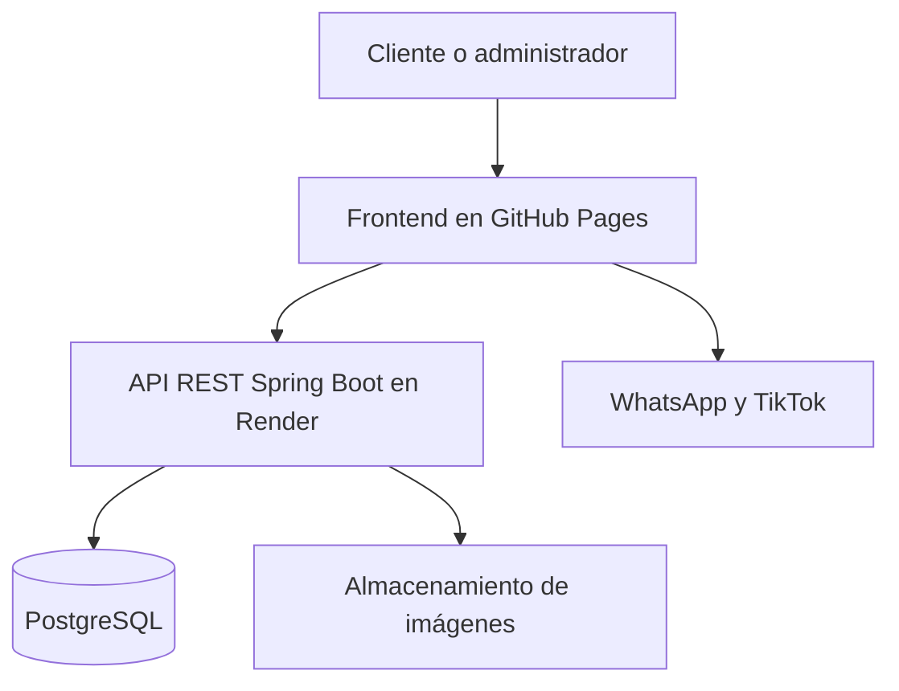

<p align="center">
  
</p>

<h1 align="center">BeaGi ModaCircular</h1>

<p align="center">
  Catálogo web responsive y panel administrativo para una tienda de moda circular de San Felipe, Chile.
</p>

<p align="center">
  <a href="https://mateocuetoc-hub.github.io/BeaGi-ModaCircular/"><strong>Ver tienda</strong></a>
  ·
  <a href="https://mateocuetoc-hub.github.io/BeaGi-ModaCircular/admin.html"><strong>Panel administrativo</strong></a>
  ·
  <a href="https://github.com/mateocuetoc-hub/beagi-backend"><strong>Repositorio backend</strong></a>
</p>

<p align="center">
  
  
  
  
</p>

## Sobre el proyecto

**BeaGi ModaCircular** es el frontend de una plataforma de catálogo y administración creada para una pyme dedicada a la venta de abrigos seleccionados y confecciones propias.

La tienda permite explorar productos, aplicar filtros, guardar favoritos y consultar directamente por WhatsApp. Además, incorpora un panel administrativo protegido para crear, editar y eliminar productos, controlar su stock y subir fotografías reales.

Este repositorio forma parte de una solución full stack:

- El frontend está desarrollado con HTML, CSS y JavaScript puro.
- La información de los abrigos se obtiene desde una API REST.
- El backend está construido con Spring Boot y se encuentra en un repositorio independiente.
- Las imágenes se almacenan mediante el servicio configurado en el backend.
- La tienda pública se despliega con GitHub Pages y la API con Render.

## Funcionalidades

### Tienda pública

- Catálogo dinámico conectado a la API de productos.
- Catálogo local de confecciones y puños removibles hechos por BeaGi.
- Respaldo local de productos si la API no está disponible.
- Buscador por nombre, tipo y descripción.
- Filtros por categoría, talla, precio y disponibilidad.
- Ordenamiento por productos destacados, precio y nombre.
- Resumen de productos disponibles, reservados y vendidos.
- Tarjetas con stock, estado, precio y distintivos de novedad o producto destacado.
- Modal de detalle con galería de varias imágenes.
- Favoritos persistentes mediante `localStorage`.
- Consulta individual o grupal de favoritos por WhatsApp.
- Secciones de novedades, confecciones, lives de TikTok, proceso de compra, preguntas frecuentes y ubicación.
- Navegación y diseño responsive para computador, tablet y celular.
- Metadatos SEO y Open Graph para compartir el sitio.

### Panel administrativo

- Inicio de sesión contra endpoints protegidos del backend.
- Resumen de productos totales, disponibles y sin stock.
- Listado administrativo con imagen, categoría, precio, stock y estado.
- Creación, edición y eliminación de productos.
- Control de disponibilidad, novedad y producto destacado.
- Selección y previsualización de imágenes antes de subirlas.
- Subida de hasta cinco imágenes JPG, PNG o WebP por producto.
- Validación de formato, cantidad y tamaño de los archivos.
- Interfaz preparada para incorporar la administración de categorías y pedidos.

> [!NOTE]
> La ruta del panel es pública, pero las operaciones administrativas están protegidas por la autenticación del backend. Las credenciales y secretos de producción no se almacenan en este repositorio.

## Arquitectura



## Tecnologías

| Área | Tecnologías |
| --- | --- |
| Interfaz | HTML5, CSS3 y JavaScript ES6+ |
| Integración | Fetch API, REST y JSON |
| Persistencia local | Web Storage (`localStorage`) |
| Backend relacionado | Java, Spring Boot y PostgreSQL |
| Despliegue | GitHub Pages y Render |
| Control de versiones | Git y GitHub |

## Estructura principal

```text
BeaGi-ModaCircular/
├── index.html                 # Tienda y catálogo público
├── admin.html                 # Panel administrativo
├── assets/
│   └── img/confecciones/      # Fotografías de confecciones locales
├── css/
│   ├── style.css              # Estilos de la tienda
│   └── admin.css              # Estilos del panel
├── img/                       # Recursos visuales generales
├── js/
│   ├── config.js              # URLs, contacto y configuración pública
│   ├── productos.js           # Respaldo local del catálogo
│   ├── confecciones.js        # Productos confeccionados por BeaGi
│   ├── script.js              # Lógica de la tienda
│   └── admin.js               # Lógica del panel administrativo
└── README.md
```

## Ejecutar el frontend localmente

### 1. Clonar el repositorio

```bash
git clone https://github.com/mateocuetoc-hub/BeaGi-ModaCircular.git
cd BeaGi-ModaCircular
```

### 2. Iniciar un servidor local

```bash
python3 -m http.server 5500
```

### 3. Abrir el sitio

- Tienda: <http://localhost:5500/>
- Panel: <http://localhost:5500/admin.html>

La configuración actual consume la API desplegada. No es necesario iniciar el backend local para recorrer la tienda publicada.

## Configuración

Los datos públicos y las direcciones de la API se centralizan en `js/config.js`:

```js
window.beagiConfig = {
    whatsappNumero: "NUMERO_EN_FORMATO_INTERNACIONAL",
    direccionPublica: "DIRECCION_PUBLICA",
    zonaPublica: "CIUDAD_Y_REGION",
    mapsQuery: "CONSULTA_PARA_GOOGLE_MAPS",
    tiktokUrl: "URL_DE_TIKTOK",
    instagramUrl: "URL_DE_INSTAGRAM",
    apiBaseUrl: "https://api.ejemplo.com/api",
    apiProductosUrl: "https://api.ejemplo.com/api/productos"
};
```

Para probar toda la aplicación con el backend local, cambia temporalmente las dos URLs de la API:

```js
apiBaseUrl: "http://localhost:8080/api",
apiProductosUrl: "http://localhost:8080/api/productos"
```

Antes de hacer un commit, recuerda devolverlas a las direcciones de producción.

## Validaciones rápidas

Antes de subir cambios se puede comprobar la sintaxis de los archivos principales:

```bash
node --check js/config.js
node --check js/script.js
node --check js/admin.js
git diff --check
```

## Despliegue

El frontend se publica mediante **GitHub Pages** desde la rama `main`.

Flujo habitual:

```bash
git status
git add README.md
git commit -m "Actualiza documentacion del frontend"
git push origin main
```

Después del `push`, GitHub Pages actualiza la versión pública. Los cambios que afecten endpoints o modelos también deben coordinarse con el repositorio del backend.

## Estado actual

El flujo principal de publicación ya está operativo:

- [x] Catálogo público conectado a la API.
- [x] Filtros, favoritos y consultas por WhatsApp.
- [x] Diseño responsive para computador y dispositivos móviles.
- [x] Panel administrativo protegido.
- [x] CRUD de productos.
- [x] Carga de múltiples imágenes por producto.
- [x] Despliegue del frontend y del backend.
- [ ] Gestión de imágenes existentes al editar un producto.
- [ ] Administración completa de categorías.
- [ ] Administración completa de pedidos.
- [ ] Pruebas automatizadas del frontend.

## Repositorios relacionados

- **Frontend:** [mateocuetoc-hub/BeaGi-ModaCircular](https://github.com/mateocuetoc-hub/BeaGi-ModaCircular)
- **Backend:** [mateocuetoc-hub/beagi-backend](https://github.com/mateocuetoc-hub/beagi-backend)

## Autor

Desarrollado por [Mateo Cueto](https://github.com/mateocuetoc-hub), estudiante de Ingeniería en Informática, como solución web para una pyme y proyecto de portafolio.
